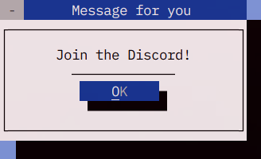

# StreamBoxes

The twitch panels, possibly stream templates and such.
based on https://github.com/gansm/finalcut/wiki/First-steps#first-steps-with-the-final-cut-widget-toolkit




ive edited the discord image in krita, all others are just crops of the titlebar.

## build
Follow: https://github.com/gansm/finalcut/tree/main?tab=readme-ov-file#installation

at the time of me working with this, it was
```bash
 git clone https://github.com/gansm/finalcut.git
 cd finalcut
 autoreconf --install --force
 ./configure --prefix=/usr
 make
 su -c "make install"
```

then, where my code is either run the makefile with ``make`` or:
```bash
g++ subscribe.cpp -o subscribe -O2 -lfinal
```

## License
GNU Lesser General Public License v3.0